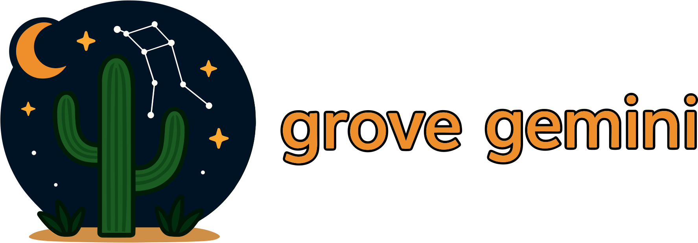

<!-- DOCGEN:OVERVIEW:START -->



Grove Gemini (`gemapi`) is a command-line interface for Google's Gemini API, designed to support development workflows. It integrates with the Grove ecosystem to provide automatic codebase context management, caching to reduce latency and cost, and a suite of observability tools for monitoring API usage.

The tool is built to handle large code contexts by leveraging the Gemini Caching API and provides (experimental) commands to query local request logs, Google Cloud metrics, and billing data.

<!-- placeholder for animated gif -->

## Key Features

*   **Smart Context Management**: Automatically builds context from your codebase using a `.grove/rules` file, powered by `grove-context`. This ensures that prompts sent to the Gemini API are informed by relevant source code without manual file gathering.

*   **Advanced Caching (experimental)**: Caches large "cold context" files using the Gemini Caching API to reduce costs and improve response times on repeated queries. Caching is an opt-in feature that includes automatic invalidation when source files change and support for TTLs. An interactive terminal UI (`gemapi cache tui`) is available for managing caches.

*   **Rich Observability (experimental)**: A comprehensive `query` command allows you to inspect API usage from multiple data sources:
    *   `query local`: View detailed local logs of all `gemapi` requests.
    *   `query metrics`: Fetch request counts and error rates from Google Cloud Monitoring.
    *   `query tokens`: Analyze token usage from Google Cloud Logging.
    *   `query billing`: Pull cost data directly from BigQuery billing exports.

*   **Token Utilities**: The `count-tokens` command can estimate costs and verify that a prompt fits within a model's context window before making an API call.

## Ecosystem Integration

Grove Gemini is a component of the Grove ecosystem and is designed to work with other tools in the suite.

*   **Grove Meta-CLI (`grove`)**: The central tool for managing the entire ecosystem. `grove` handles the installation, updating, and version management of all Grove binaries, including `grove-gemini`.

*   **Grove Context (`cx`)**: Manages the context provided to LLMs. `gemapi` uses `grove-context` to automatically gather relevant source code based on predefined `.grove/rules`. This provides the Gemini models with the necessary information to perform their tasks accurately.

## Installation

Install via the Grove meta-CLI:
```bash
grove install gemini
```

Verify installation:
```bash
gemapi version
```

Requires the `grove` meta-CLI. See the [Grove Installation Guide](https://github.com/mattsolo1/grove-meta/blob/main/docs/02-installation.md) if you don't have it installed.

<!-- DOCGEN:OVERVIEW:END -->

## Documentation

See the [documentation](docs/) for detailed usage instructions:
- [Overview](docs/01-overview.md) - Introduction and core concepts
- [Examples](docs/02-examples.md) - Common usage patterns
- [Experimental Features](docs/03-experimental.md) - Beta features
- [Configuration](docs/04-configuration.md) - Configuration reference
- [Command Reference](docs/05-command-reference.md) - Complete CLI reference


<!-- DOCGEN:TOC:START -->

See the [documentation](docs/) for detailed usage instructions:
- [Overview](docs/01-overview.md) - 
- [Examples](docs/02-examples.md) - This document provides a series of practical examples to demonstrate the capa...
- [Experimental](docs/03-experimental.md) - This section covers features in `grove-gemini` that are currently experimenta...
- [Configuration](docs/04-configuration.md) - `grove-gemini` is configured through a combination of environment variables, ...
- [Command Reference](docs/05-command-reference.md) - This document provides a comprehensive reference for the `gemapi` command-lin...

<!-- DOCGEN:TOC:END -->
